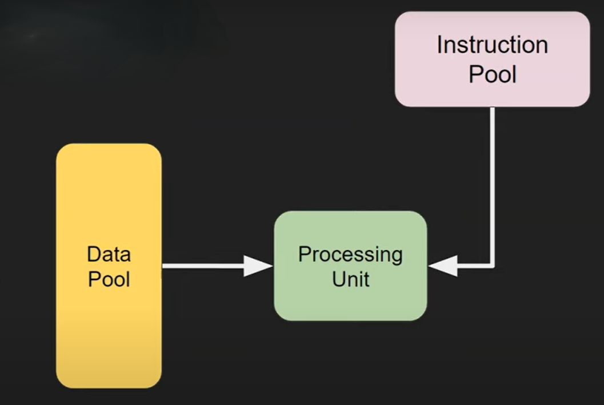
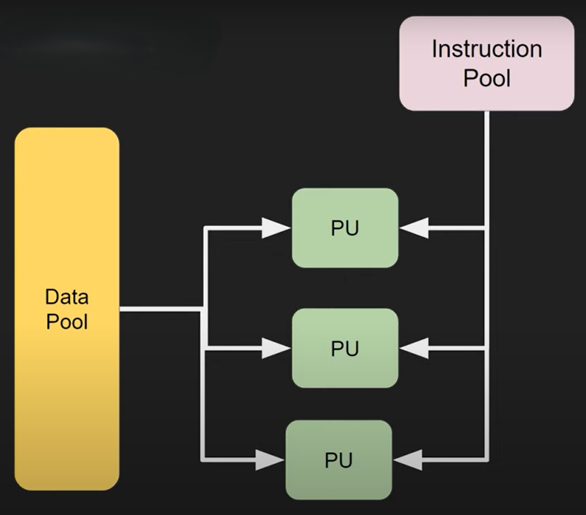
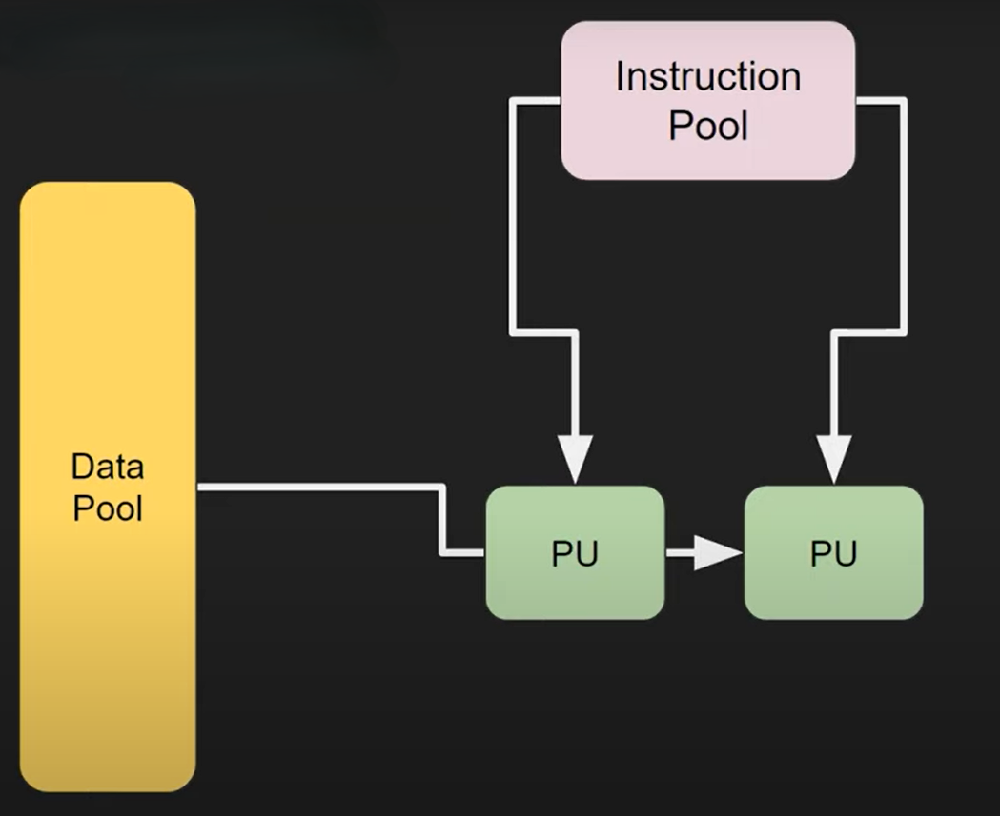
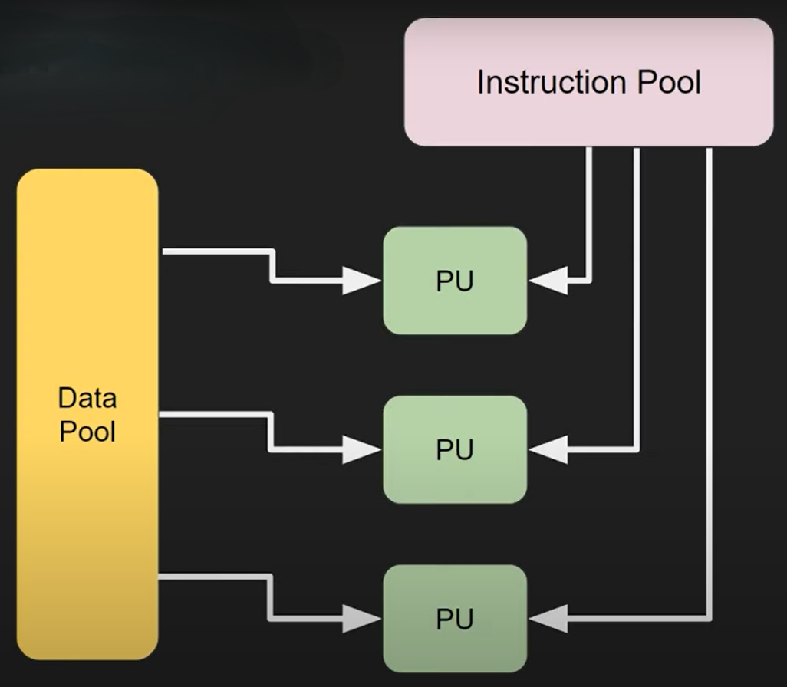

# Clasificacion Segun la Taxonomia de Flynn

|                    |Simple Data|Multiple Data|
|-                   |:-:        |:-:          |
|Simple Instruction  |SISD |SIMD  [OPENMP](#openmp-simd) [MPI](#mpi-simd)  [MULTIPROCESSING](#multiprocessing-simd)|
|Multiple Instruction|MISD  [OPENMP](#openmp-misd) [MPI](#mpi-misd)|MIMD  [OPENMP](#openmp-mimd) [MPI](#mpi-mimd) [MULTIPROCESSING](#multiprocessing-mimd)|

## OPENMP

**(SIMD)** OpenMP trabaja con multiples 
procesadores y el uso de la memoria es compartida, es decir una sola fuente de datos con $n$ procesadores que realizan la misma instrucción.  

**(MISD)** Ademas cada procesador puede trabajar de forma independiente con instrucciones propias, es decir una sola fuente de datos con $n$ procesadores que realizan diferentes instrucciones.  

**(MIMD)** Pero ademas el uso de la memoria puede ser distribuida (cada procesador posee su propio espacio en memoria), es decir distintas fuentes de datos con $n$ proceadores que realizan diferentes instrucciones.

## MPI

**(MIMD)** MPI trabaja con multiples 
procesadores y el uso de la memoria no es compartida (cada procesador posee su propio espacio en memoria), es decir distintas fuentes de datos con $n$ proceadores que realizan diferentes instrucciones.  

**(MISD)** Se podría simular una memoria compartida con el uso de mensajes **MPI_Send() y MPI_Recv()** asi, entonces cada procesador puede trabajar de forma independiente con instrucciones propias haciendo uso de una sola fuente de datos, es decir una sola fuente de datos con $n$ procesadores que realizan diferentes instrucciones.  

**(SIMD)** Con el uso de mensajes **MPI_Send() y MPI_Recv()** tambien se podría simular este comportamiento una sola fuente de datos con $n$ procesadores que realizan la misma instrucción.

## MULTIPROCESSING

**(MIMD)** Multiprocessing trabaja con multiples procesadores y el uso de la memoria es distribuida (cada proceso posee su propio espacio en memoria), es decir distintas fuentes de datos con $n$ proceadores que realizan diferentes instrucciones o la misma instrucción en cada proceso.  

**(SIMD)** Ademas multiprocessing posee una clase **SharedMemory** que permite el trabajo con memoria compartida, de esta forma cada procesador puede trabajar de forma independiente con la misma fuente de datos, es decir una sola fuente de datos con $n$ procesadores que realizan la misma instrucción.