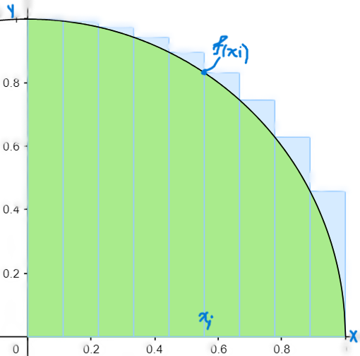

# CALCULANDO PI MEDIANTE SUMAS DE RIEMANN $\sum_{i=1}^{n}f(x_{i})\Delta x$
Sabiendo que el área de un circulo es: $A = \pi r^{2}$, luego tomando un circulo de radio 1 tendríamos: $\pi = {A}$.  
Luego hacieno uso de las herramientas de Cálculo I graficaremos una circunferencia a partir de su ecuación $y^{2} + x^{2} = 1$, representada como función tendríamos $y = f(x) = {\color{red}\pm}\sqrt{1 - x^{2}}$ del cual tomaremos solo la parte correspondiente al primer cuadrante por lo tanto la funcion quedaría de la siguiente manera: $f(x) = \sqrt{1 - x^{2}}$.  
Ahora dividimos la region en $n$ subintervalos.

De esta forma podemos aproximarnos al área bajo la curva $f(x) = \sqrt{1 - x^{2}}$ en el intervalo $[0-1]$ que es $\frac{1}{4}A$, donde $A$ es el area total del circulo.  
Sabiendo que el area de un rectangulo es base por altura sumamos el área de cada rectangulo, donde la base de cada rectangulo es la diferencia entre $x_{i+1} - x_{i}$ el cual llamaremos $\Delta x$, que tiene una longitud de $\frac{1}{n}$ ya que dividimos esta region en n subintervalos, de esta forma tenemos  $\Delta x = \frac{1}{n}$.  
Ademas la altura de cada rectangulo se obtiene a partir de la función **$f(x_{i}) = \sqrt{1-x_{i}^{2}}$** para algún $x_{i}$ dentro del intervalo $[0-1]$  

Reemplazando en la Sumatoria $\sum_{i=1}^{n}f(x_{i})\Delta x$ se tiene lo siguiente: $$\sum_{i=1}^{n}\sqrt{1-x_{i}^{2}}\:\frac{1}{n}$$
Luego podemos hallar un valor equivalente para $x_{i}$ de la siguiente manera:
$$x_{i}=a+i\Delta x\text{, donde } a = 0 \text{ ya que partimos del origen.}$$
entonces la ecuación quedaría de la siguiente forma:
$$x_{i}=i\frac{1}{n} = \frac{i}{n}$$
Reemplazando se tiene lo siguiente: $$\sum_{i=1}^{n}\sqrt{1-\left(\frac{i}{n}\right)^{2}}\:\frac{1}{n}$$
Que es aproximadamente $\frac{1}{4}$ del área de nuestro circulo de radio 1 donde $A=\pi$, entonces:
$$\sum_{i=1}^{n}\sqrt{1-\left(\frac{i}{n}\right)^{2}}\:\frac{1}{n}\simeq \frac{\pi}{4}$$
Despejando $\pi$ y realizandoalgunas sinplificaciones obtenemos los siguiente:
$$\pi \simeq\frac{4}{n^{2}}\sum_{i=1}^{n}\sqrt{n^{2}-i^{2}}$$
Se utilizara esta expresión para calcular un valor aproximado a $\pi$ con programación paralela. Haciendo uso de la librería **MPI** en el lenguaje de programación C y la librería **multiprocessing** en el lenguaje de programación python.